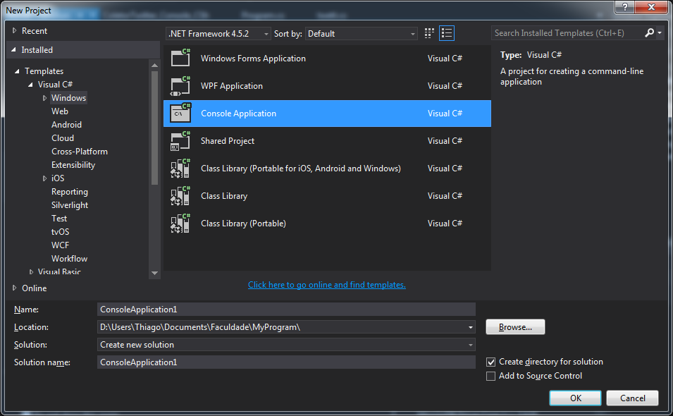
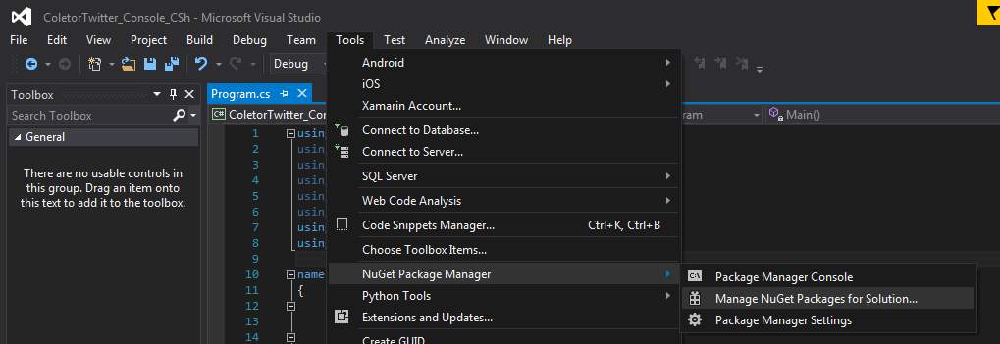
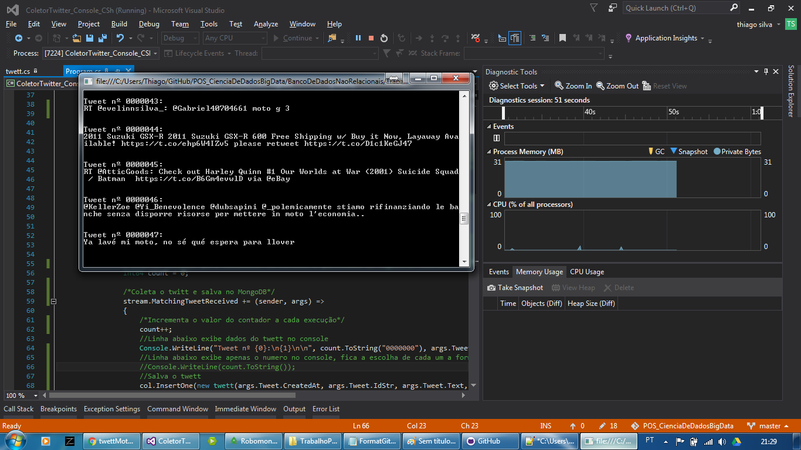
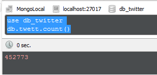
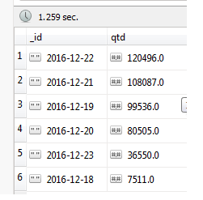
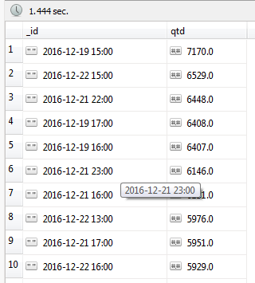
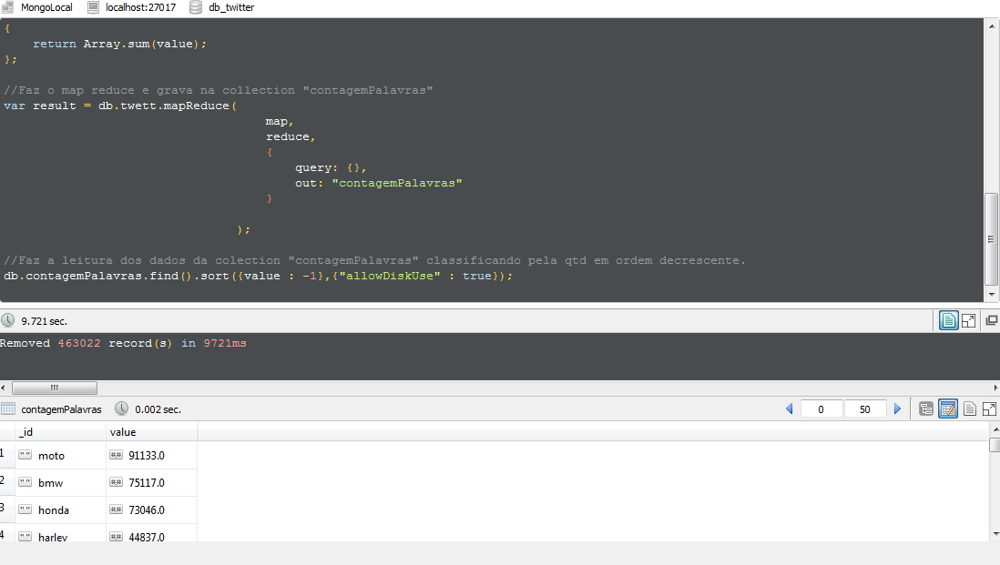

## Coleta de dados do Twitter ##
Trabalho prático realizado para avaliar o conhecimento obtido na disciplina de Banco de Dados Não Relacionais do curso de Pós Graduação em Ciência de dados e Big Data da PUC Minas.
<br/>Professor: [Gabriel Coutinho](https://github.com/gcouti)
<br/>
### Missão: ###
Coletar informações de redes sociais ou importar dados externos armazenando-os em um banco de dados NoSQL.
Extrair Informações do tipo:
<br/>•	Termos mais frequentes.
<br/>•	Volume X dia.
<br/>•	Volume X hora do dia
<br/>
### Hardware: ###
O trabalho foi realizado em um Notebook de domestico com a seguinte configuração:
<br/>•	Processador Intel Core I7.
<br/>•	8GB de memória RAM DDR3.
<br/>•	1 TB de HD.
<br/>•	Windows 7 64 bits.
<br/>
### Contexto e aplicação: ###
O professor nos deu liberdade para escolher a fonte da informação e o assunto.
<br/>Optei por coletar dados do Twitter devido a facilidade em encontrar na web informações sobre a API.
<br/>Sou apaixonado por motocicletas e por este motivo resolvi fazer uma busca de assuntos relacionados a motos, utilizando como palavras chave:
<br/> “moto”, “motocicleta”, “motociclista”, “motoboy”, “viagem de moto”, e também as marcas “Honda”, “Yamaha”, “kawasaki”, “Suzuki”, “harley”, “harley Davidson”, “harleydavidson”, “dafra” e “BMW”.
<br/>
### Metodologia: ###
Devido minha experiencia em C# utilizando o Visual Studio, optei por realizar a atividade da seguinte forma:
<br/>• Coleta dos dados utilizando o [Microsoft Visual Studio 2015](https://www.visualstudio.com/pt-br/vs/).
<br/>• Banco de dados [MongoDB](https://www.mongodb.com/).
<br/>• [Robomongo](https://robomongo.org/) para interagir com a base de dados MongoDB.
<br/>
### Passo a passo: ###

Utilizando o Microsoft Visual Studio 2015 criei um "Console Application" (File --> New Project --> ).
<p align="center"></p>
<br/>
Após criar o projeto é necessário adicionar a sua solução o [MongoDriver](https://www.nuget.org/packages/MongoDB.Driver) para que a aplicação possa interagir com o servidor e o [Tweetinvi](https://tweetinvi.codeplex.com/) para coleta dos dados do Twitter.
A adição dos itens acima foi realizada através do [Nuget](https://marketplace.visualstudio.com/items?itemName=NuGetTeam.NuGetPackageManagerforVisualStudio2015) já incorporado ao meu Visual Studio.
<p align="center"></p>
<br/>Após criar o aplicativo adicionei uma classe com o nome "twett" e adicionei o seguinte código.
''c#
using System;
using System.Collections.Generic;
using System.Linq;
using System.Text;
using System.Threading.Tasks;
using MongoDB.Bson;
using MongoDB.Bson.Serialization.Attributes;


namespace ColetorTwitter_Console_CSh
{
    [Serializable]
    public class twett
    {
        public twett()
        {

        }

        public twett(DateTime dataCriacao, string idStr, string text, string lang)
        {
            this.dataCriacao = dataCriacao;
            this.idStr = idStr;
            this.text = text;
            this.lang = lang;
        }

        [BsonElement("dataCriacao")]
        public DateTime dataCriacao { get; set; }

        [BsonElement("idStr")]
        public string idStr { get; set; }

        [BsonElement("text")]
        public string text { get; set; }

        [BsonElement("lang")]
        public string lang { get; set; }
    }
}

```
<br/>A classe acima é responsavel por criar os objetos no formato Bson para envio ao banco de dados MongoDB.
<br/>Após a criação da classe, volte em "Program.cs" e adicione o seguinte código em "Class Program". 
<br/>• Obs.: Os dados para autenticação no twitter devem ser obtidos na [página para desenvolvedores](https://apps.twitter.com/) do twitter.
```c#
static void Main()
{
	try
	{
		/*Dados para autenticação no twitter*/
		string consumerKey = "add";
		string consumerSecret = "add";
		string userAccessToken = "add";
		string userAccessTokenSecret = "add";
		Auth.SetUserCredentials(consumerKey, consumerSecret, userAccessToken, userAccessTokenSecret);

		/*Nome do servidor, base e coleção do MongoDB onde os dados serão armazenados*/
		string serverMongo = "localhost";
		string dbMongo = "db_twitter";
		string collectionsMongo = "twett";

		/*Dados para autenticação no MongoDB e leitura dos dados no formato da classe "twett"*/
		string conn_mongo = "mongodb://" + serverMongo + "/";
		var client = new MongoClient(conn_mongo);
		var db = client.GetDatabase(dbMongo);
		var col = db.GetCollection<twett>(collectionsMongo);

		/*Coletor de dados do twitter*/
		var stream = Stream.CreateFilteredStream();

		/*Adição das plavras chave para busca dos twetts*/
		stream.AddTrack("moto");
		stream.AddTrack("motocicleta");
		stream.AddTrack("motociclista");
		stream.AddTrack("motoboy");
		stream.AddTrack("viagem de moto");
		stream.AddTrack("honda");
		stream.AddTrack("yamaha");
		stream.AddTrack("kawasaki");
		stream.AddTrack("suzuki");
		stream.AddTrack("harley");
		stream.AddTrack("harley davidson");
		stream.AddTrack("harleydavidson");
		stream.AddTrack("dafra");
		stream.AddTrack("bmw");

		/*Cria um contador para visualizar no console a quantidade de registros coletados*/
		Int64 count = 0;

		/*Coleta o twett e salva no MongoDB*/
		stream.MatchingTweetReceived += (sender, args) =>
		{
			/*Incrementa o valor do contador a cada execução*/
			count++;
			//Linha abaixo exibe dados do twett no console
			//Console.WriteLine("Tweet nº {0}:\n{1}\n\n", count.ToString("0000000"), args.Tweet);
			//Linha abaixo exibe apenas o numero no console, fica a escolha de cada um a forma de exibir a informação no console.
			Console.WriteLine(count.ToString());
			//Salva o twett
			col.InsertOne(new twett(args.Tweet.CreatedAt, args.Tweet.IdStr, args.Tweet.Text, args.Tweet.Language.ToString()));
		};

		stream.StartStreamMatchingAllConditions();

	}

	catch (Exception e)
	{
		Console.WriteLine(e.Message.ToString());
		Console.ReadLine();
	}

}
```
<br/>
Feito os passos acima, basta iniciar a aplicação para coletar os dados do Twitter. Abaixo um print do console em execução.
<p align="center"></p>
<br/>Iniciei a coleta no dia 18/12/2016 as 22:14 e finalizei no dia 23/12/2016 as 08:50 (Data e hora em GMT 0) coletando 452.773 registros.


### Resultados: Tempo de execução das consultas, informações extraídas. ###
<br/>Utilizando o [Robomongo](https://robomongo.org/) vamos visualizar alguns dados em nossa base.
#### A utilização do Robomongo é opcional, todos os códigos aqui citados podem ser utilizados em qualquer IDE para interação com o MongoDB, inclusive via prompt de comando.
<br/>Visualizar a quantidade de registros na coleção.
```
//Usado para acessar a mesma base que a aplicação armazenou os dados
use db_twitter
//Faz a contagem de registros (Documentos) na coleção twett
db.twett.count()
```
<p align="center"></p>
```
<br/>Que tal vermos a quantidade coletada por dia?
```
db.twett.aggregate([
                    {
                        $group: { _id: {$dateToString: {format: "%Y-%m-%d", date: "$dataCriacao"}}
                        , qtd: {$sum: 1}}
                    }
                    ,{$sort: {qtd: -1}}]
                    ,{"allowDiskUse" : true}
                  )
```
<p align="center"></p>
```
<br/>Que tal detalharmos ainda mais os dados do dia? Vamos ver os horários com maior volume.
```
db.twett.aggregate([
                    {
                        $group: { _id: {$dateToString: {format: "%Y-%m-%d %H:00", date: "$dataCriacao"}}
                        , qtd: {$sum: 1}}
                    }
                    ,{$sort: {qtd: -1}}]
                    ,{"allowDiskUse" : true}
                  )
```
<p align="center"></p>
<br/>Vamos aprofundar um pouco mais. Que tal sabermos quais as palavras mais utilizadas?
<br/> Para fazer a busca de palavras iremos utilizar o Map Reduce dentro do próprio MongoDB.
```Javascript
//Comanda para limpar os dados da collection "contagemPalavras"
db.contagemPalavras.remove({});
//Etapa map
var map = function()
{  
    //Define stopwords, ou seja, as palavras que devem ser desconsideradas.
    var stopwords = "rt,a,e,i,o,u,de,to,-,in,la,en,for,the,is,me,no,and,y,que,of,el,un,new,on".replace(" ","").split(',');
    //Pega o conteudo do tweet e separa as palavras por espaço
    var words = this.text.toLowerCase().split(" ");
    
    //Função para eliminar as stopwords
    var contains = function()
    {
        for(var j=0; j<stopwords.length; j++)
            if(words[i]==stopwords[j].toLowerCase().trim())
                return true;
                return false;
     };
 
    //Função que faz a leitura de todas as palavras e incrementa + 1 a cada vez que a mesma palavra é encontrada. 
    for (var i = 0; i < words.length -1; i++)
        {
            //A parte  "&& !contains()" do if chama a função de remoção das stopwords, removendo esta parte veremos todas as palavras.
            if (words[i] != "" && !contains())
            emit(words[i], 1);
        }    
};
    
//Função para reduce.
var reduce = function (key, value)
{
    return Array.sum(value);
};

//Faz o map reduce e grava na collection "contagemPalavras"
var result = db.twett.mapReduce(
                                    map,
                                    reduce,
                                    {
                                        query: {},
                                        out: "contagemPalavras"
                                    }

                                );

//Faz a leitura dos dados da colection "contagemPalavras" classificando pela qtd em ordem decrescente.
db.contagemPalavras.find().sort({value : -1},{"allowDiskUse" : true});
```
<p align="center"></p>
<br/>  Note que no print acima temos apenas os primeiros registros no entanto a consulta traz uma quantidade bem maior de informações.
<br/>
### Conclusões: Considerações sobre o trabalho ###
<br/>A evolução tecnológica tem ajudado muito a humanidade, e a cada dia temos um numero maior de informações saindo do padrão “Normalizado” tornando necessário a utilização de bases de dados NoSQL, mas vale lembrar que nem sempre o NoSQL será a melhor opção. É necessário fazer uma analise previa da necessidade do negocio e a partir de tal analise decidir  o melhor banco de dados a se utilizar.
<br/>Como foi possível ver nos exemplos acima, analises muito complexas podem ser realizadas em uma velocidade muita rápida nos bancos NoSQL, funções como a contagem de palavras aqui exemplificada demoram muito mais tempo para processar em uma base de dados relacional.
<br/>Vimos também que as empresas possuem um poder analítico gigantesco sobre o que está acontecendo nas redes sociais, com apenas algumas linhas de código é possível responder perguntas do tipo “O que andam falando da minha empresa?”, ou até mesmo analisar o que se fala da politica, de alguma tragédia, etc.
<br/>Um ponto de extrema importância para as analises realizadas é entender a necessidade do negocio, no exemplo praticado por mim a intenção foi responder a pergunta "o que mais se fala sobre motos?" Vimos que a palavra mais utilizada foi “moto” no entanto se fizermos uma analise mais profunda nos dados será possível ver que parte considerável da palavra “moto” foi utilizada para fazer referencia ao celular da fabricante Motorola.
<br/>Em resumo. Temos um grande poder nas mãos mas precisamos saber utiliza-lo pois uma analise mal feita pode levar a decisões erradas dentro de uma corporação.
